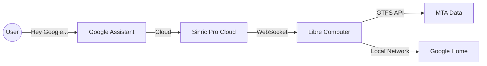

# Home Train Service

A voice-activated Node.js service that announces real-time NYC Subway arrival times on a Google Home device.

## Overview
This project allows you to say "Hey Google, turn on Downtown" and hear the next arrival times for the Cathedral Parkway (110 St) station directly from your Google Home speaker.

It runs locally on a **Libre Computer** board and uses **Sinric Pro** to bridge the gap between Google Assistant and the local network without needing port forwarding or public tunnels.

## Architecture



1.  **Trigger**: User speaks to Google Assistant.
2.  **Relay**: Google talks to Sinric Pro (Virtual Switch).
3.  **Signal**: Sinric Pro sends a signal down an open WebSocket connection to the Board.
4.  **Fetch**: Board fetches real-time train data from MTA.
5.  **Announce**: Board generates TTS audio and casts it to the Google Home via local IP.

## Hardware & Network Info
*   **Device**: Libre Computer Renegade (ROC-RK3328-CC)
*   **OS**: Ubuntu Server
*   **Board IP**: `192.168.1.136` (SSH Access)
*   **User**: `ubuntu`

## Configuration (`.env`)
Create a `.env` file in the root directory. **Do not commit this file.**

```properties
# Network Configuration
PORT=3001
GOOGLE_HOME_IP=********

# Sinric Pro Credentials (https://portal.sinric.pro)
SINRIC_APP_KEY=********
SINRIC_APP_SECRET=********
SINRIC_DEVICE_ID_DOWNTOWN=device-id-for-downtown-switch
SINRIC_DEVICE_ID_UPTOWN=device-id-for-uptown-switch
```

## Developer Guide

### Prerequisites
*   Node.js (v18+)
*   Git
*   PM2 (Process Manager)

### Accessing the Board
```bash
ssh ubuntu@192.168.1.136
```

### Deployment Workflow
The code runs on the board but is developed on your local machine (Windows).

1.  **Make Changes** locally (VS Code).
2.  **Push** to GitHub:
    ```powershell
    git add .
    git commit -m "Description of changes"
    git push
    ```
3.  **Pull** on the Board (SSH):
    ```bash
    cd home-train-service
    git pull
    npm install # If dependencies changed
    ```
4.  **Restart Service**:
    ```bash
    pm2 restart train-service
    pm2 logs # Monitor output
    ```

### Important Commands (Board)
*   `pm2 status`: Check if service is running.
*   `pm2 logs`: View real-time logs (broadcasts, errors).
*   `pm2 restart train-service`: Apply code changes.
*   `nano .env`: Edit environment variables.

### Key Libraries
*   `sinricpro`: WebSockets for Google Home triggers.
*   `castv2-client`: Casting audio to Google Home.
*   `gtfs-realtime-bindings`: Parsing MTA Protocol Buffer data.
*   `google-tts-api`: Converting text to MP3 urls.

## Important Links
*   [Sinric Pro Portal](https://portal.sinric.pro/dashboard) - Manage devices/keys.
*   [MTA Real-Time Data Feeds](https://api.mta.info/#/landing) - GTFS documentation.
*   [Libre Computer Wiki](https://hub.libre.computer/) - Hardware docs.
